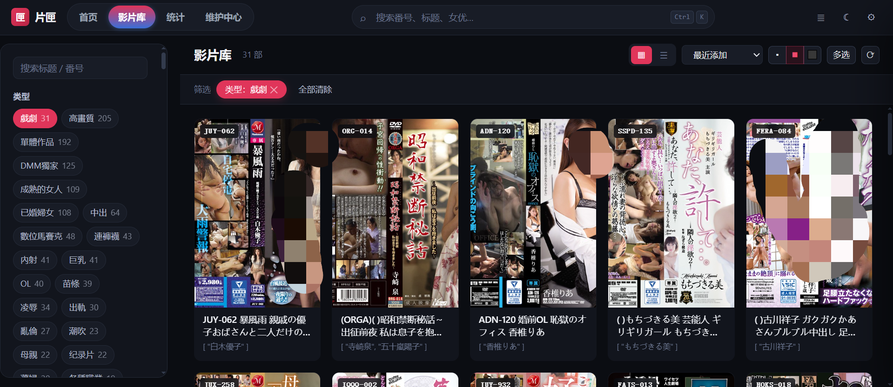
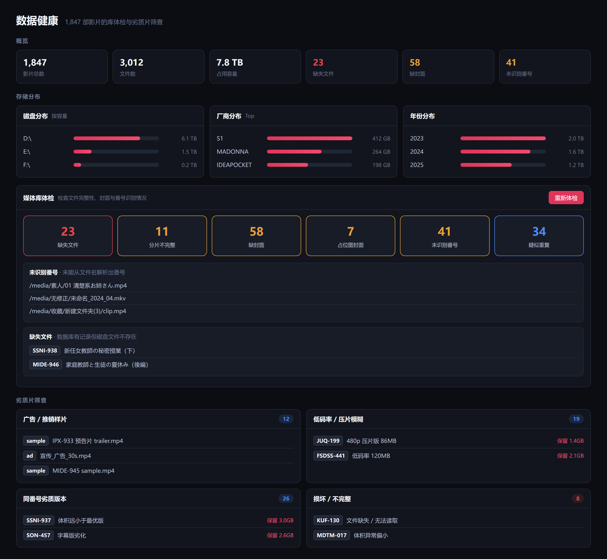
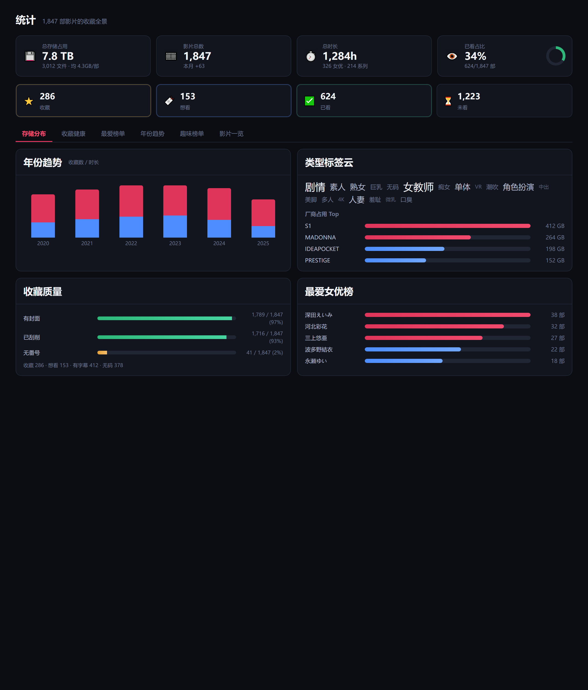
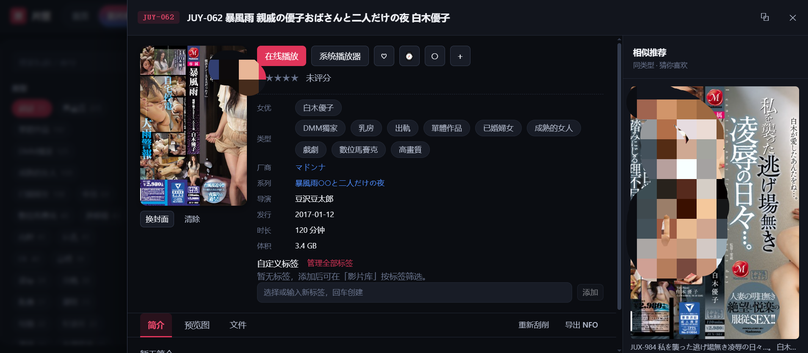

<h1 align="center">FilmBox · AVM (Adult Video Manager)</h1>

<p align="center">
  <b>Local-first · Privacy-safe · Self-hostable</b><br/>
  Turn a messy, scattered AV collection on your drives into a private library you can <b>search, curate, and revisit</b>.
</p>

<p align="center">
  
  
  
  
  
</p>

<p align="center">
  <a href="#why-do-you-need-filmbox">Why you need it</a> ·
  <a href="#core-features">Core features</a> ·
  <a href="#why-filmbox-instead-of-other-tools">Why choose it</a> ·
  <a href="#highlights-in-1100">Highlights</a> ·
  <a href="#download--install">Download</a> ·
  <a href="#quick-start">Quick start</a>
</p>

---

## 😩 Do you suffer from these "collector's headaches"?

- You've swapped drives time and again, **stored thousands of titles but can't find** the one or two you actually want to watch.
- The **same title sits in your library seven or eight times**: uncensored, censored, subtitled, re-encoded… wasting space and impossible to tell apart.
- Filenames like `IRO061C`, `SONE-760CH`, `300MAAN-123` — **non-standard naming** that ordinary tools simply can't recognize.
- Wrong covers, failed scraping, and **amateur titles with no cover at all**.
- "That one where the actress was a teacher…" — **you try to recall, but can't**.
- Interrupted halfway through, **progress lost, restart from the beginning** next time.
- Afraid of privacy leaks, sites shutting down, or losing your collection when you change computers.

**FilmBox is built specifically to cure these headaches for serious collectors.**

---

## ✅ Why you need FilmBox

In one sentence: **your collection deserves a proper "library", not just a pile of folders.**

| Without FilmBox | With FilmBox |
| --- | --- |
| Chaotic filenames, relying on memory to dig around | Auto-normalized IDs, faceted filtering + semantic search, locate in seconds |
| The same title duplicated seven or eight times | Content-level dedup + multi-version merge, keeps only the best copy |
| Missing covers, failed scraping | Pluggable multi-source + cross-source fallback; even amateur titles with IDs get covers |
| Whether you've watched something is pure guesswork | Zero-config playback monitoring, auto-records progress, watched or not at a glance |
| Collection stored on someone else's servers | Fully local, no account, no network reporting, copy the data and it just works |

> **Runs entirely locally and, by default, reports nothing to the network. AI also goes through your own endpoint — keys are only sent to the address you configure. Your collection stays yours.**

---

## ✨ Core features

<p align="center">
  
</p>

- **🗂 Auto scan & build library**: recursively scans directories, strips site/uploader/technical noise, skips sample/trailer/recycle bins; small preview clips are ignored outright.
- **🔍 Non-standard ID recognition**: names like `IRO061C`, `SONE-760CH`, `300MAAN-123` — "letters glued to digits, with version tails" — are normalized to `IRO-061` / `SONE-760`, and automatically tag subtitle (`-C`) / uncensored (`-U`) / VR / 4K / multi-part.
- **🧹 Multi-version merge + content dedup**: uncensored/censored/director's cut/subtitled are auto-grouped into one title; precise duplicates identified by "size + content hash". **Obvious splits (`-cd1`/`(1)`/`-a`) are recognized as a set and never misjudged as duplicates or wrongly deleted.**
- **🖼 Metadata scraping**: pluggable data sources (JavBus / JavDB / AV-Wiki / local `.nfo` / custom JSON·HTML rules) fill in cover, actresses, genres, series, studio, rating, synopsis; manual entry works when scraping fails.
- **🤖 Optional AI enhancement**: compatible with any OpenAI-protocol endpoint — fill a key for cloud, or use local Ollama key-free. Natural-language search like "find a few story-driven ones where the actress is a teacher" pulls them right up; one-click synopsis generation and tag completion on the detail page. Auto-degrades to plain search when AI is disabled.
- **📺 Zero-config playback monitoring**: hand a file to VLC / PotPlayer / MPC / mpv and the background auto-records "how long watched, where stopped, finished or not"; resume progress, similar recommendations, and "my viewing" preference analysis so the next pick is easy.
- **🩺 Data health checkup**: six media issues (missing file / incomplete parts / missing cover / placeholder image / unrecognized ID / suspected duplicate) + four low-quality screenings (ad samples / low bitrate / inferior same-ID version / corrupted), one-click keep-best and clean-up.
- **🎴 Gallery curation**: card wall + actress wall + tag cloud + smart playlists (auto-aggregated by rules) + similar recommendations, turning "hoarding" into "something you can pull out and watch".
- **📡 Remote access**: scan a QR code from your phone / LAN device to open instantly, with token auth + firewall-pass hints (`edge=yes` edge traversal that works without disabling the whole firewall).
- **⏱ Scheduled auto-scan**: auto incremental import on a periodic basis after new downloads, no need to click scan every time.
- **💬 Subtitle matching**: pick subtitle files right in the browser and upload them; they're aligned and renamed by ID so your system player loads them on open.

---

## 🆚 Why FilmBox instead of other tools

Market options fall into two rough camps: **general media scrapers** (TinyMediaManager, MediaElch, XBVR, etc. — film/TV first, AV only barely compatible) and **various JAV mini-scripts** (single-purpose, no UI). FilmBox is a **one-stop, domain-tuned local library purpose-built for AV collections**.

| What you actually care about | General scraper | DIY script | **FilmBox AVM** |
| --- | --- | --- | --- |
| **Recognizes non-standard IDs?** | Usually only standard names | Single-source lookup, no normalization | 7 rule classes dedicated parsing, normalization + tag recognition |
| **Same title no longer seven copies?** | Manual merge needed | Basically unsupported | Auto-merge + content-level dedup, splits not misjudged |
| **Accurate AV metadata?** | Weak AV cataloging, covers often wrong | Depends on single site, dead if it goes down | Pluggable multi-source + cross-source fallback; even amateur titles with IDs get covers |
| **Strong anti-bot sources (AV-Wiki)?** | N/A | Manual browser maintenance | Built-in CDP scraping, persistent headless Chrome auto-bypasses verification pages (requires Chrome installed locally, otherwise auto-falls back to normal requests) |
| **Curate by "work" not "folder"?** | Folder-centric | List only | Actress wall / tag cloud / smart playlists / similar recommendations |
| **Resume after interruption?** | Needs player plugin | None | Zero-config monitoring of any system player, auto-records progress |
| **See library dirt at a glance?** | Basically none | None | Six health checks + four low-quality screenings, one-click cleanup |
| **AI semantic search?** | Most none | None | Optional, any OpenAI endpoint / local Ollama |
| **Privacy & deployment?** | Desktop GUI / resident service | Scattered scripts | Pure local Web, no account, single-command packaged no-install exe |

> **In short: it's not just another "web page that plays video", but a local library with heavy domain adaptation (IDs, dedup, amateur titles, watch-resume, health checkup) for the special field of AV collecting.**

---

## 🌟 Highlights in 1.10.0

> Release date: 2026-08-15

- **💬 Subtitle matching now picks files directly**: on the maintenance page click "Choose files" to upload subtitles, matched to library titles by ID and one-click aligned/renamed (with copy-to-keep-original support).
- **🧹 Repeat detection strengthens split recognition**: beyond `_1`/`-cd1`/`.part3`, added bracket `(1)`, `[2]`, single-letter `-a`, and resolution-tagged `1080p-1` split detection; an ID's trailing digit is no longer mistaken for a sequence number.
- **🔔 About-page version check**: hooks into GitHub Releases, shows current/latest version with release notes, supports custom update sources.
- **📡 Remote access as its own tab**: multi-address click-to-switch QR generation, custom token, firewall-pass hints.
- **⏱ Scheduled auto-scan**: periodic background incremental import by minute interval.

Full changelog in **[`CHANGELOG.md`](CHANGELOG.md)**.

---

## 📦 Download & install

Don't want to build it yourself? Download the release package directly (Windows single-folder zip, extract and run):

<p align="center">
  <a href="https://github.com/dengji85/avm/releases/latest">
    
  </a>
</p>

1. Go to **[Releases](https://github.com/dengji85/avm/releases)** and download the latest `AVM-win64.zip`.
2. Extract to any directory (e.g. `D:\AVM\`), double-click `AVM.exe` to launch — it auto-opens your browser into the Web UI.
3. Data (library / covers / config) lives in the `data/` directory — **copy the whole folder to back up or migrate**.

---

## 🚀 Quick start

### Option 1: Run from source (development)

```bash
pip install -r requirements.txt
python run.py serve            # backend http://127.0.0.1:8770
cd web_src && npm install && npm run dev   # frontend http://localhost:5173
```

### Option 2: Build then host as a whole

```bash
cd web_src && npm install && npm run build
python run.py serve            # serves web_dist/ directly
```

### Package as a no-install build

```bash
python build.py                # produces dist/片匣/片匣.exe
```

---

## 🖼 More screenshots

<details>
<summary><b>Expand module screenshots</b> (data health · statistics · detail)</summary>

<br/>

<p align="center">
  
  <br/><sub>Data health: six checks + four low-quality screenings</sub>
</p>

<p align="center">
  
  <br/><sub>Statistics: storage / title count / duration / watched ratio + yearly trend + tag cloud + actress ranking</sub>
</p>

<p align="center">
  
  <br/><sub>Detail drawer: cover + resume + AI synopsis + similar recommendations</sub>
</p>

</details>

> Cover areas in screenshots are neutral placeholder blocks, not real content; actual covers are determined by your local metadata.

---

## 🔒 Privacy & compliance

- All collection data stays local, **no network reporting by default**.
- Network access only happens for: the data sources you enable, and the AI endpoint you configure yourself.
- Use only to manage local files you **legally possess**, and comply with the laws of your region and the terms of the data-source sites.

---

## 🛠 Tech stack

| Layer | Tech |
| --- | --- |
| Backend | Python · FastAPI · SQLite |
| Frontend | Vue 3 · Vite · native CSS-variable theming |
| Scraping | Chrome DevTools Protocol (headless Chrome) · multi-source adapters |
| Packaging | PyInstaller · npm run build |

## 📄 License

MIT — for personal study and managing your own collection only.

---

Full usage guide in **[`docs/使用手册.md`](docs/使用手册.md)**, dev docs in **[`docs/开发文档.md`](docs/开发文档.md)**, upgrade/migration in **[`docs/升级指南.md`](docs/升级指南.md)**, changelog in **[`CHANGELOG.md`](CHANGELOG.md)**.
