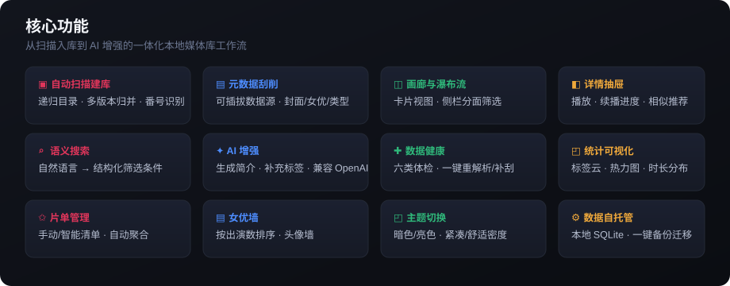
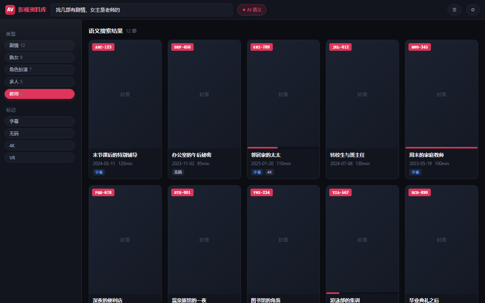
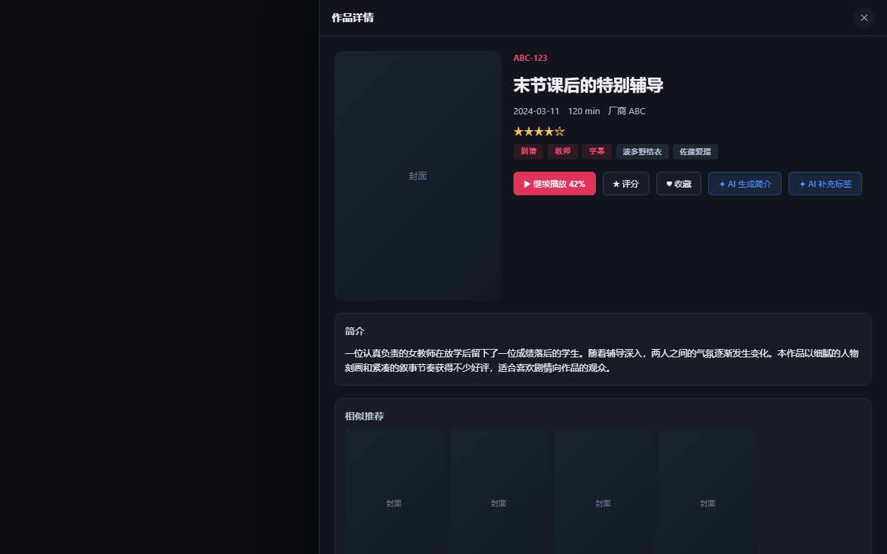
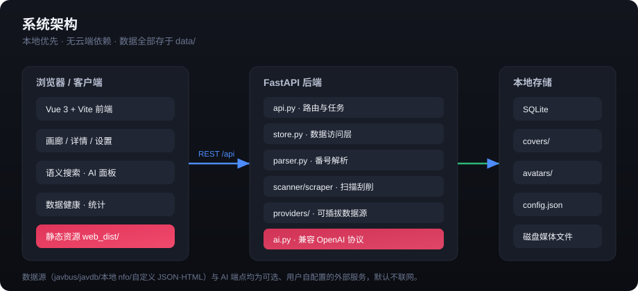

<p align="center">
  
</p>

<h1 align="center">本地影视资料库 · 媒体库管理工具</h1>

<p align="center">
  <b>本地优先 · 隐私安全 · 可自托管</b><br/>
  一个用于整理、刮削与检索本地影视收藏的单机应用：自动扫描建库、可插拔元数据来源、画廊浏览、语义搜索与可选 AI 增强。
</p>

<p align="center">
  
  
  
  
</p>

---

## ✨ 亮点

- **🖥 纯本地运行**：所有数据存于本地 `data/`，默认不联网、不上传，可随目录整体备份迁移。
- **🔌 可插拔数据源**：内置多个元数据适配器（含本地 `.nfo` 离线模式），可按需启用。
- **🧠 可选 AI 增强**：兼容 OpenAI 协议的任意端点（云端 / 本地 Ollama），用于生成简介、补充标签、语义搜索——**不内置模型，密钥只发往你配置的地址**。
- **🎨 双主题**：暗色 / 亮色一键切换，原生控件随主题正确渲染。
- **📦 单目录打包**：一条命令生成可分发版本，免安装依赖即可运行。

---

## 💎 核心价值

> **懂行的人，才懂这些痛。**

收藏几千部、硬盘换了一茬又一茬，可真正让人抓狂的从来不是「存不下」，而是——**存了之后根本找不到、看过了却记不清、想二刷却翻不到那一两部**。这个工具就是给资深爱好者做的，专门治这些「老毛病」。

1. **番号一塌糊涂？智能识别替你收拾**
   文件名 `IRO061C`、`SONE 760CH` 这种字母紧贴数字、带版本尾巴的「野路子」命名，普通软件直接歇菜。这里能自动识别、归一化成标准番号，多版本（无码/有码/导剪/中字）自动归并到同一部，靠内容哈希去重——**再也不会同一部在库里躺七八份**。

2. **刮削失败、封面张冠李戴？**
   可插拔的数据源 + 本地 `.nfo` 离线模式，一键补齐封面、女优、类型、系列；新增「数据健康」体检，六类问题（缺失文件、分片不完整、缺封面、占位图、未识别番号、疑似重复）一眼看清，还能一键重解析番号、补刮元数据。

3. **「上次那部女主是老师的」——靠脑子想不如靠筛选**
   分面筛选按女优 / 类型 / 厂商 / 系列 / 年份 / 标记精准定位；女优墙按出演数排；标签云、片单（手动 + 智能规则自动聚合）、相似推荐，把「囤」变成「能翻出来看」。开启 AI 后还能直接写自然语言：「找几部有剧情、女主是老师的」——它帮你翻出来。

4. **看到一半被打断？进度接着来**
   续播进度自动记，列表上直接看到看到哪、有没有看完；相似推荐和观看记录让你「下一部看啥」不用纠结。

5. **怕被平台关、怕隐私漏、怕换电脑全没了？**
   全本地、无账号、不联网上报，数据就在 `data/` 目录里，拷走即用。AI 也走你自己的端点（云端或本地 Ollama），密钥只发给你配的地址。**你的收藏，始终是你自己的。**

6. **给同好，也来自同好**
   前后端一体、单命令打包成免安装版本，能直接在自家设备上跑、能随手发给朋友。数据源和 AI 都是可插拔的——你熟悉哪路资源，就接哪路，工具不绑定任何一家。

---

## 🖼 界面一览

<p align="center">
  
  <br/>
  <sub>画廊 + AI 语义搜索 · 暗色主题 · 侧栏分面筛选 · 续播进度</sub>
</p>

<p align="center">
  
  <br/>
  <sub>详情抽屉 · AI 生成简介 / 补充标签 · 相似推荐</sub>
</p>

<p align="center">
  
</p>

> 截图中的封面区域为中性占位块，不代表真实作品内容；真实运行时封面由你本地元数据决定。

---

## 🚀 快速开始

### 方式一：源码运行（推荐开发）

```bash
# 1. 安装后端依赖
pip install -r requirements.txt

# 2. 启动后端（默认 http://127.0.0.1:8770）
python run.py serve

# 3. 启动前端开发服务器（默认 http://localhost:5173）
cd web_src
npm install
npm run dev
```

浏览器打开 `http://localhost:5173` 即可。

### 方式二：构建前端后整体托管

```bash
cd web_src && npm install && npm run build   # 产物输出到 web_dist/
python run.py serve                          # 服务直接托管 web_dist/
```

### 打包为可分发包

```bash
python run.py build      # 生成单目录打包到 dist/
python run.py pack 1.0.0 # 生成带版本号的发布包
```

> 打包已包含前端产物（`web_dist`）与 `app/ai.py` 等全部子模块，无需额外配置。

---

## 🧩 核心功能

| 模块 | 说明 |
| --- | --- |
| **自动扫描建库** | 递归扫描目录，按命名规则识别编号/版本，多版本自动归并，按内容去重。 |
| **元数据刮削** | 可插拔数据源适配器，抓取封面、女优、类型、系列等信息；支持本地 `.nfo` 离线模式。 |
| **画廊与瀑布流** | 卡片视图 + 侧栏分面筛选（女优 / 类型 / 厂商 / 年份 / 标记）。 |
| **详情抽屉** | 播放、续播进度、相似推荐、收藏/评分/想看。 |
| **语义搜索** | 自然语言描述 → 结构化筛选条件，自动套用并展示结果（AI 未启用时降级为关键词检索）。 |
| **AI 增强（可选）** | 详情页「生成简介 / 补充标签」；兼容 OpenAI 协议端点（云端或本地 Ollama）。 |
| **数据健康** | 六类体检：缺失文件 / 分片不完整 / 缺封面 / 占位图 / 未识别编号 / 疑似重复；一键重解析编号、补刮元数据。 |
| **统计可视化** | 标签云、观看日历热力图、时长分布（按年）。 |
| **片单管理** | 手动清单与智能清单（按规则自动聚合）。 |
| **女优墙** | 按出演数排序的头像墙与女优详情。 |
| **主题与密度** | 暗色/亮色 + 紧凑/舒适密度，偏好本地持久化。 |

---

## 🗂 项目结构

```
app/           后端（FastAPI）：api / store / parser / scanner / scraper / providers / ai / images
web_src/       前端源码（Vue3 + Vite）
web_dist/      前端构建产物（被服务托管）
data/          运行时数据：library.db、config.json、covers/、avatars/、nfo/
docs/          使用手册、开发文档、配图
build.py       源码版打包脚本（PyInstaller）
run.py         入口：serve / build / pack / dev
```

更完整的架构、接口清单与开发约定见 **[`docs/开发文档.md`](docs/开发文档.md)**，使用说明见 **[`docs/使用手册.md`](docs/使用手册.md)**。

---

## ⚙️ 配置

配置存于 `data/config.json`（与缺省值合并），主要段：

- `scan_dirs`：扫描根目录。
- `scraper`：启用的数据源、代理、Cookie、并发。
- `ffmpeg_path`：抽帧预览用。
- `ai`：可选 AI 端点（`enabled` / `base_url` / `api_key` / `model` / `temperature`）。

也可在图形界面的「设置」页修改，无需手改文件。

---

## 🔒 隐私与合规

- 所有收藏数据均在本地，**默认不联网上报**。
- 联网行为仅发生在：你启用的元数据数据源、以及你自行配置的 AI 端点。
- 请仅用于管理你**合法持有**的本地文件，并遵守所在地区法律法规与数据源站点的服务条款。

---

## 🛠 技术栈

| 层 | 技术 |
| --- | --- |
| 后端 | Python · FastAPI · SQLite · requests |
| 前端 | Vue 3 · Vite · 原生 CSS 变量（主题） |
| 打包 | PyInstaller · npm run build |

---

## 📄 许可证

MIT —— 仅供个人学习与管理自用收藏。
