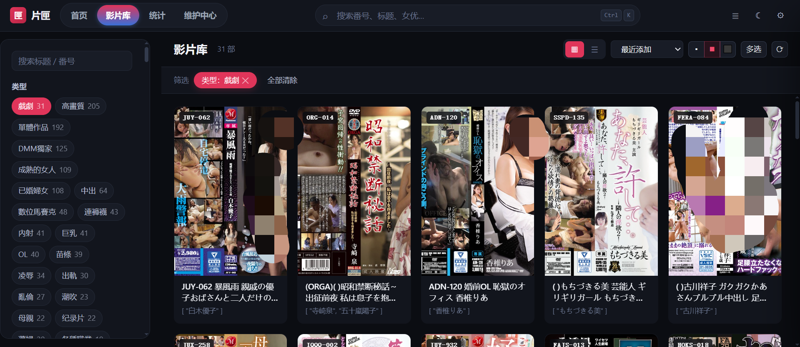
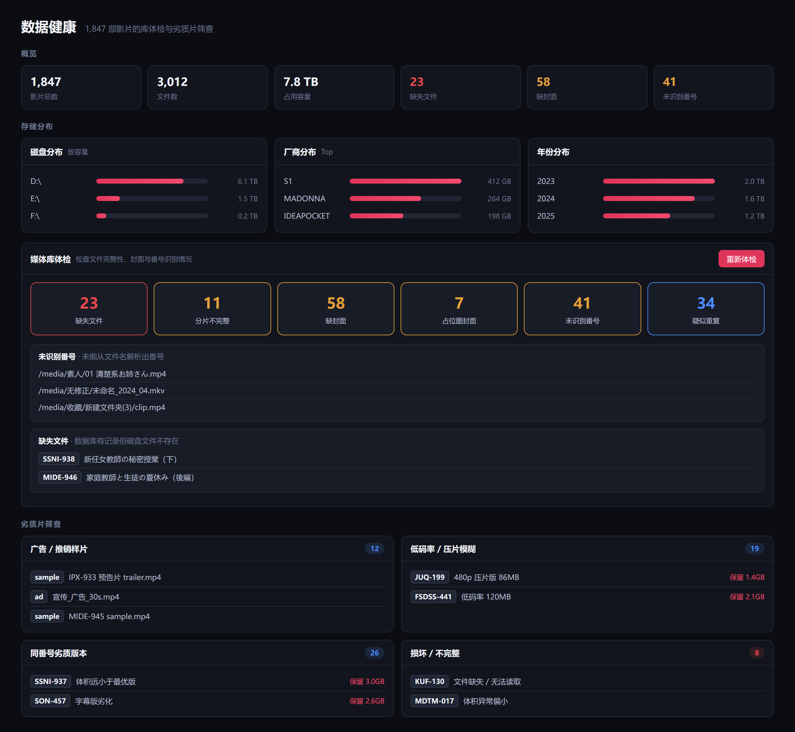
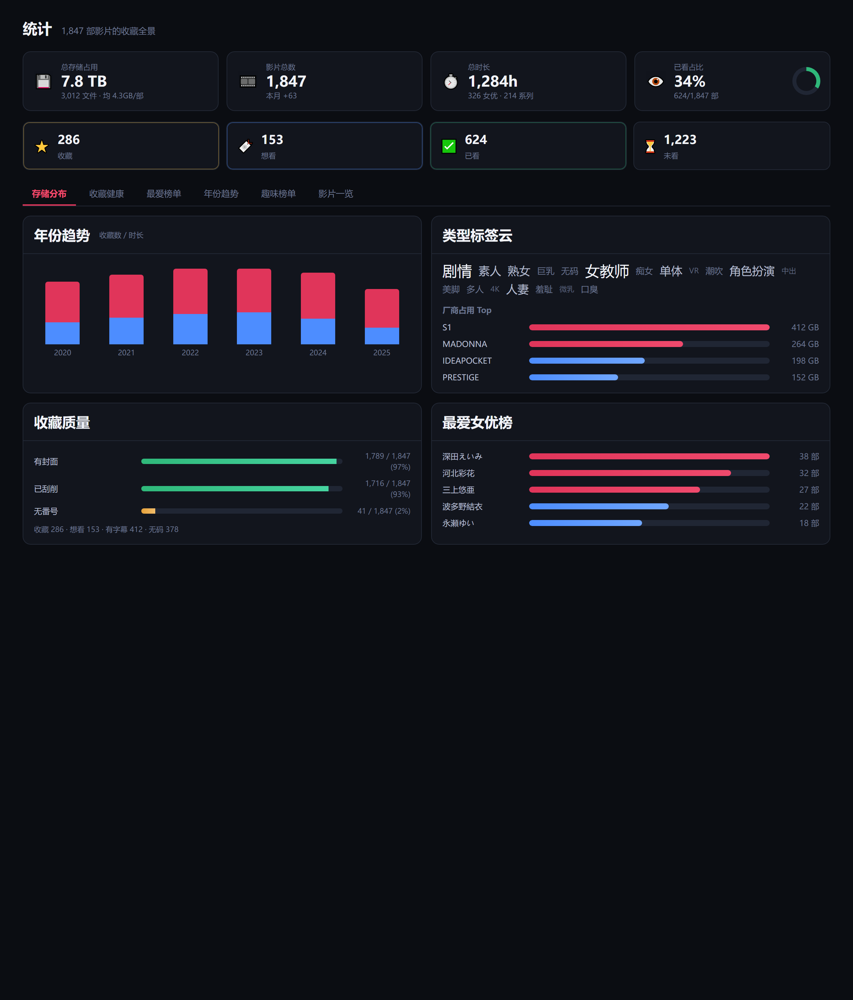
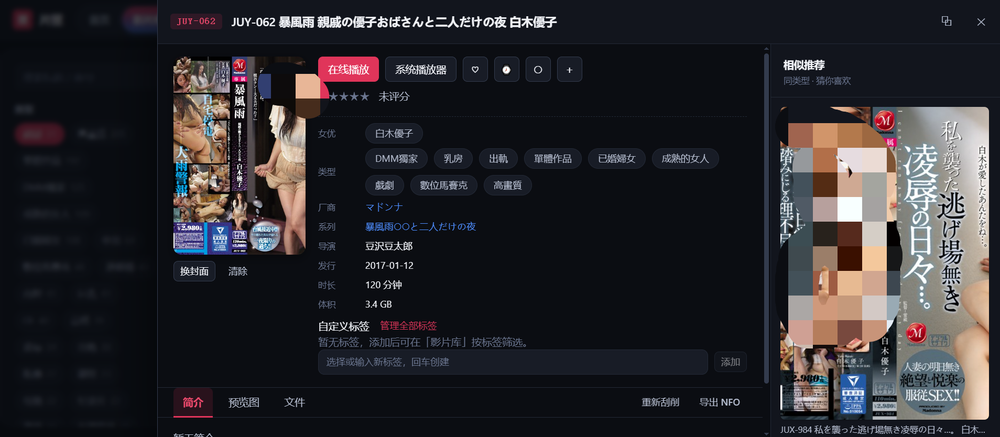

<h1 align="center">片匣 · AVM（Adult Video Manager）</h1>

<p align="center">
  <a href="README.md">中文（简体）</a> ·
  <a href="README.zh-TW.md">中文（繁體）</a> ·
  <a href="README.en.md">English</a> ·
  <a href="README.ja.md">日本語</a>
</p>

<p align="center">
  <b>本地优先 · 隐私安全 · 可自托管 · 技术栈性能优异</b><br/>
  把硬盘里命名乱七八糟、散落各处的 AV 收藏，变成一处<b>能管理、能刮削、能统计、能分析</b>的私人资料库——<b>不只是存片，更是帮你读懂自己的口味</b>；片单即播、小工具傍身、局域网/移动端随处看。
</p>

<p align="center">
  <b>AVM (Adult Video Manager)</b> — a local-first, privacy-safe media library for your AV collection. It scrapes metadata, deduplicates, analyzes your taste, and turns scattered files into a searchable personal archive you fully own.
  <br/>▶ <b>See it in 30 seconds — demo below.</b>
</p>

<p align="center">
  
  
  
  
  
</p>

<p align="center">
  <a href="#下载与安装">下载</a> ·
  <a href="#解决的问题">解决的问题</a> ·
  <a href="#产品理念">产品理念</a> ·
  <a href="#核心功能">核心功能</a> ·
  <a href="#为什么选片匣而不是别的工具">为什么选它</a> ·
  <a href="#本次更新亮点1120">更新亮点</a> ·
  <a href="#快速开始">快速开始</a>
</p>

---

## 🎬 30 秒看懂片匣

<p align="center">
  
  <br/><sub>↑ 占位：将 15–30 秒录屏存为 <code>docs/assets/avm_demo.gif</code>（建议镜头：扫描建库 → 女优墙 → 详情刮削 → 网页即播）</sub>
</p>

> **一句话**：把散落硬盘的 AV 文件，扫成**能搜、能去重、能看女优资料、能网页即播**的私人资料库——全程本地运行，数据全在你自己手里。

---

## 📦 下载与安装

<p align="center">
  <a href="https://github.com/dengji85/avm/releases/latest">
    
  </a>
</p>

1. 到 **[Releases](https://github.com/dengji85/avm/releases)** 下载单个 `AVM-<版本号>.exe`（如 `AVM-1.12.0.exe`）。
2. 放到任意目录（如 `D:\AVM\`），双击启动，自动打开浏览器进入 Web UI。
3. 升级时**把新 `AVM-*.exe` 放到同目录、删掉旧 exe 即可**——数据（`data/` 库/封面/配置）在同目录自动保留，无需手动替换前端资源。
4. 备份迁移：`AVM-*.exe` 与 `data/` 一起拷贝即可。

---

## 💡 产品理念

> **片匣不只是把片子存起来，而是帮你认识自己的喜好——从「囤片」到「懂片」，再顺手「看好片」。**

我们把这条链路拆成六步，层层递进：

1. **管理** —— 本地、隐私、零账号，上千部影片井井有条，番号归一、去重归并，不再靠记忆翻找。
2. **刮削** —— 多源自动补全元数据（封面、女优、类型、系列、评分、简介），把一堆文件变成「有结构的数据」。
3. **统计 + 分析** —— 收藏沉淀为可量化的**个人观影画像**：类型分布、女优偏好、时长与年份趋势、看没看完。
4. **片单 + 喜好洞察** —— 系统片单（播放最多 / 评分最高 / 群星荟萃 / 最近入库）与智能片单（多维条件自动聚合）不只是「分类」，更是**你口味的可视化**：一眼看见「原来我偏爱这类题材、这位女优、这种节奏」。
5. **更好的观看体验** —— 片单即点即播、续播进度自动记住；局域网/移动端随处看，手机扫码进、平板接着播，下饭不挑设备。
6. **小工具傍身** —— 内容级去重、大文件/劣质片检查、字幕匹配、健康体检，把「整理收藏」变成一键小事。

**为什么快而稳**：前端 Vue 3 + 后端 FastAPI（异步 ASGI）+ SQLite 轻量存储，**技术栈性能优异**——扫描、刮削、检索都在本地异步跑，千部规模依旧秒开秒搜，不卡顿。

**关键转化**：数据是你的，分析也是为你自己服务的——**越用，越懂你，越好看。**

---

## 🧩 解决的问题

- **找不到**：上千部命名混乱的文件，靠记忆翻——番号自动归一 + 分面筛选 + 语义搜索，秒定位。
- **重复多**：同一部无码/有码/中字躺了七八份——内容级去重 + 多版本归并，只留最佳版。
- **刮不全**：封面缺失、素人片没封面、刮削失败——多源可插拔 + 跨源回退，有番号素人片也补齐。
- **记不住**：上次那部女主是老师的、看到哪了——AI 语义搜索 + 零配置观看进度，下饭不纠结。
- **怕丢失**：怕平台关站、怕隐私泄露——全程本地、无账号、不联网上报，数据拷走即用。

> **全程本地运行，默认不联网上报。AI 也走你自己的端点，密钥只发给你配的地址——你的收藏，始终是你自己的。**

---

## ✨ 核心功能

<p align="center">
  
</p>

- **🗂 自动扫描建库**：递归扫描、剥离站点噪声、跳过 sample/预告；支持自动嗅探同目录图片作本地封面。
- **🔍 野路子番号识别**：`IRO061C`/`SONE-760CH`/`300MAAN-123` 归一为 `IRO-061`/`SONE-760`，自动识别字幕/无码/VR/4K/分卷。
- **🧹 多版本归并 + 内容去重**：无码/有码/中字归同一部；按大小+内容哈希识别精确重复，分段 `-cd1`/`(1)`/`-a` 识别为合集绝不误删。
- **🖼 元数据刮削**：可插拔数据源（JavBus / JavDB / AV-Wiki / 本地 `.nfo` / 自定义 JSON·网页规则），补齐封面、女优、类型、系列、评分、简介；支持手动补与 NFO 双向归档。
- **🤖 可选 AI 增强**：兼容任意 OpenAI 协议端点（云端 Key 或本地 Ollama 免 Key），自然语言搜片、一键生成简介标签；未启用自动降级。
- **🎬 网页内播放 + 观看监控**：内置播放器网页串流即点即看，也能监控 VLC/PotPlayer/mpv 自动记进度；续播、相似推荐、「我的观影」偏好分析一应俱全。
- **🩺 数据健康体检**：六类媒体问题 + 四类劣质片筛查，一键保留最佳版、清理冗余。
- **🎴 画廊策展**：卡片墙/女优墙/标签云/相似推荐；智能片单与合集按类型·女优·系列+状态多选（AND/OR）自动聚合，内置「播放最多/评分最高/群星荟萃/最近入库」系统片单。
- **🧑‍🎤 女优资料与管理**：女优墙一览全部女优；详情含维基百科整篇简介 + gfriends 头像（可看大图）；支持关注、收藏、合并重名、重命名，并从影片详情以弹框形式查看不丢当前页。
- **👆 滑动刷片**：卡片式左右滑——想看 / 跳过 / 收藏 / 评分 / 撤销，支持随机、未看、未评分等模式，随手整理口味。
- **📅 年度回顾**：基于观看与收藏数据生成年度观影报告。
- **💬 字幕匹配**：浏览器选文件上传，按番号对齐重命名，播放器打开即加载。
- **🔌 可插拔插件**：女优资料（维基百科 / gfriends 头像）等以插件形式挂载，设置页统一开关，架构可扩展。
- **📡 远程访问**：手机/局域网扫码即开，Token 鉴权 + 防火墙放行提示（`edge=yes` 边缘穿越）。
- **⏱ 定时自动扫描**：新片按周期自动增量入库。

---

## 🆚 为什么选片匣而不是别的工具

市面方案大致两类：**通用媒体刮削器**（TinyMediaManager、MediaElch、XBVR 等——影视为主，AV 只是勉强兼容）和**各种 JAV 小脚本**（能力单一、无界面）。片匣是**专为 AV 收藏做领域适配的一站式本地资料库**。

| 你真正在乎的 | 通用刮削器 | 自建脚本 | **片匣 AVM** |
| --- | --- | --- | --- |
| **野路子番号认得出？** | 通常只认规范命名 | 单源查号，无归一化 | 专用番号解析，归一化 + 标记识别 |
| **同一部不再躺七八份？** | 多版本需手动归并 | 基本不支持 | 自动归并 + 内容级去重，分段不误判 |
| **AV 元数据准？** | 对 AV 编目偏弱、封面易错 | 依赖单站，挂了即空 | 多源可插拔 + 跨源回退，有番号素人片也补封面 |
| **强反爬源（AV-Wiki）？** | 不涉及 | 需手动养浏览器 | 内置 CDP 抓取，常驻 headless Chrome 自动绕过验证页（需本机已装 Chrome，否则自动回退普通请求） |
| **以「作品」而非「文件夹」策展？** | 以文件夹为中心 | 只有列表 | 女优墙 / 标签云 / 智能片单 / 相似推荐 |
| **中断能续播？** | 需播放器插件 | 无 | 网页内串流即看，并监控任意系统播放器自动记进度，随时续播 |
| **库脏了能一键看清？** | 基本无 | 无 | 六类体检 + 四类劣质片筛查，一键清理 |
| **AI 语义搜索？** | 多数无 | 无 | 可选，兼容任意 OpenAI 端点 / 本地 Ollama |
| **隐私 & 部署？** | 桌面 GUI / 常驻服务 | 散装脚本 | 纯本地 Web、无账号、单命令打包免安装 exe |

> **简言之：它不是又一个「能放视频的网页」，而是为 AV 收藏这个特殊领域做了大量领域适配（番号、去重、素人、观看回归、体检）的本地资料库。**

---

## 🌟 本次更新亮点（1.12.0）

> 发布日期：2026-08-25

- **🧑‍🎤 女优资料体系上线**：新增女优资料插件，支持中/日文名刮削，自动从维基百科抓取并整篇存档简介；接入 gfriends 头像源批量拉取头像并支持大图查看；女优详情页支持作品排序筛选；从影片详情点女优以**弹框**打开，不丢当前页状态。可在设置页统一管理女优资料数据源。
- **🎬 片单播放升级为全屏弹框**：片单「即点即播」改为可放大 / 全屏的播放弹框，连续队列更沉浸。
- **🚀 任务中心线程池**：后台刮削、头像抓取改并发执行，大库处理更快。
- **🔧 图片下载代理修复**：封面 / 头像统一走刮削代理，墙内抓取更稳。

完整变更见 **[`CHANGELOG.md`](CHANGELOG.md)**。

---

## 🚀 快速开始

### 源码运行（开发）

```bash
pip install -r requirements.txt
python run.py serve            # 后端 http://127.0.0.1:8770
cd web_src && npm install && npm run dev   # 前端 http://localhost:5173
```

### 打包为免安装单文件 exe

```bash
cd web_src && npm run build
python build.py                # 生成单文件 dist/AVM.exe（已内嵌前端）
```

---

## 🖼 更多界面

<details>
<summary><b>展开模块截图</b>（数据健康 · 统计 · 详情）</summary>

<br/>

<p align="center">
  
  <br/><sub>数据健康：六类体检 + 四类劣质片筛查</sub>
</p>

<p align="center">
  
  <br/><sub>统计：存储 / 影片数 / 时长 / 已看占比 + 年份趋势 + 标签云 + 女优榜</sub>
</p>

<p align="center">
  
  <br/><sub>详情抽屉：封面 + 续播 + AI 简介 + 相似推荐</sub>
</p>

</details>

> 截图中封面区域为中性占位块，不代表真实内容；真实封面由你本地元数据决定。

---

## 🔒 隐私与合规

- 所有收藏数据均在本地，**默认不联网上报**。
- 联网仅发生在：你启用的数据源、以及你自行配置的 AI 端点。
- 请仅用于管理你**合法持有**的本地文件，并遵守所在地区法律法规与数据源站点服务条款。

---

## 🛠 技术栈

| 层 | 技术 |
| --- | --- |
| 后端 | Python · FastAPI · SQLite |
| 前端 | Vue 3 · Vite · 原生 CSS 变量主题 |
| 抓取 | Chrome DevTools Protocol（headless Chrome）· 多源适配器 |
| 打包 | PyInstaller · npm run build |

## 📄 许可证

MIT —— 仅供个人学习与管理自用收藏。

---

完整使用说明见 **[`docs/使用手册.md`](docs/使用手册.md)**，开发文档见 **[`docs/开发文档.md`](docs/开发文档.md)**，升级迁移见 **[`docs/升级指南.md`](docs/升级指南.md)**，更新历史见 **[`CHANGELOG.md`](CHANGELOG.md)**。
